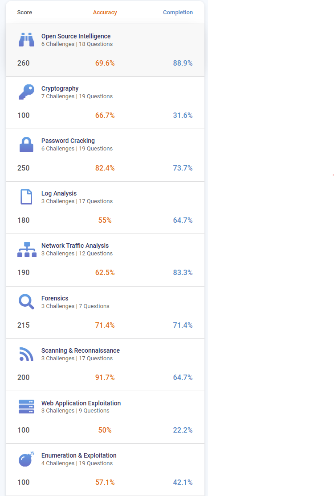

  

<h1 align="center">🛡️ NCL Spring 2025 Individual Game</h1>
<h3 align="center">National Cyber League Capture the Flag | Spring 2025</h3>

  🗓️ Spring 2025 &nbsp; | &nbsp; 🧠 Cyber Defense | Penetration Testing | Threat Analysis &nbsp; | &nbsp; 🏆 Top % (to be updated once final rank is published)

---

## 🏁 Overview

I participated in the **National Cyber League Spring 2025 Individual CTF**, competing against thousands of cybersecurity enthusiasts in a high-intensity, real-world CTF environment.  

📌 **Points:** `1695 / 3000`  
📌 **Accuracy:** `68.3%`  
📌 **Completion:** `60.9%`  
📌 **Time:** `2 days, 7 hours`  

---

## 📊 Performance Breakdown

| Category                      | Completion | Accuracy |
|-------------------------------|------------|----------|
| 🧠 Survey                     | 100%       | –        |
| 🕵️ Open Source Intelligence   | 89%        | –        |
| 🌐 Network Traffic Analysis   | 83%        | –        |
| 🔓 Password Cracking          | 74%        | –        |
| 🔬 Forensics                  | 71%        | –        |
| 📄 Log Analysis               | 65%        | –        |
| 📡 Scanning & Reconnaissance  | 65%        | –        |
| 💣 Enumeration & Exploitation | 42%        | –        |
| 🔐 Cryptography               | 32%        | –        |
| 🛠️ Web App Exploitation      | 22%        | –        |

---

## 🧠 Skills Demonstrated

- 🔍 Open-source intelligence collection and analysis  
- 🔐 Password cracking and authentication bypass techniques  
- 🌐 Network traffic analysis & forensic packet inspection  
- 🕵️ Log review and incident investigation  
- 📡 Reconnaissance and vulnerability scanning  
- 💥 Exploitation and enumeration in simulated targets  
- 🧩 Applied cryptography and cipher challenges  
- 🛠️ Web application exploitation fundamentals  

---

## 📸 Screenshots

  
📊 Scorecard & Skills Tracker

  

  
🏅 Leaderboard Rank

  

---

## 💡 Takeaways

✅ Strengthened my skills in **network, OSINT, and password cracking**  
✅ Improved accuracy across multiple modules compared to Fall 2024  
✅ Identified growth areas in **web exploitation and cryptography**  
✅ Reinforced ability to work under time pressure in real-world CTF settings  

---

## 📬 Connect with Me  

💼 [LinkedIn](https://www.linkedin.com/in/marianjohn/)  
🌐 [Portfolio](https://marianjosephjeffrey.com/)  
🛡️ [TryHackMe](https://tryhackme.com/p/mjcube)  
📫 mjcube1999@gmail.com  

---

⭐ Proud to be part of the NCL community — learning, hacking, growing! 🚀
